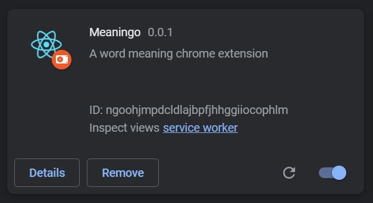
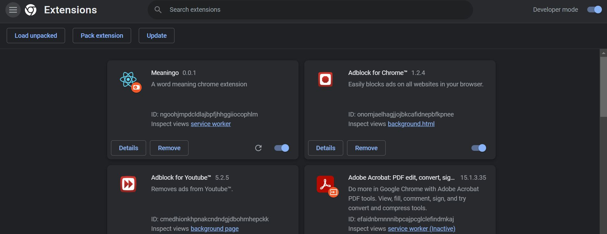

# Meaningo!

A word meaning chrome extension



 ## Description:
 Meaningo is a chrome extension built using JavaScript, through which a user can get the meaning of any word on right click > Get Meaning. On clicking "Get Meaning", the original word gets replaced with its meaning with a red text color. We are using Free Dictionary API for getting the meanings of the words. If the word is missplled or meaning is not found, the word gets replaced with "!Meaning not found!".

 ## This extension is made using:
1. JavaScript
2. [Free Dictionary API](https://dictionaryapi.dev/)

 ## Pre-requisites to run the repo on localhost:
   1. Node
 
 ## To run the repository on the system:
   1. Clone the repository and head to the base folder by running the following command in your CMD/bash/terminal: 
   ```
      git clone https://github.com/tiwarishubham635/meaningo.git
      cd meaningo
   ```
   2. Install node_modules in the base folder by running:
   ```
      npm install
   ```
   3. Prepare the production build by running the following command. This will create a "build" folder in the base folder
   ```
      npm run build
   ```
   4. Go to your Chrome Extensions Page (chrome://extensions/) on your chrome browser and enable the "Developer mode"
   5. Click "Load unpacked" and select the build folder created
   6. Open any website and start using!


 ## Snapshots
 1. Add Meaningo in your chrome extensions: <br/><br/>
    
 3. Go to any website on chrome and select a word: <br/><br/>
    
 4. Right click and select "Get Meaning": <br/><br/>
    
 5. Find the meaning replacing the original word in red color text: <br/><br/>
    
